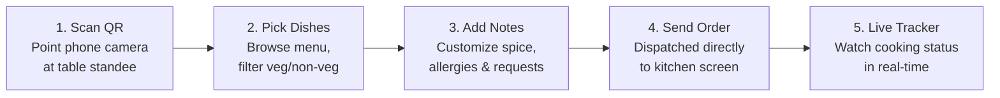

# Order Desk · Diner QR Self-Ordering Guide

> **Welcome to the Modern Dining Experience!**  
> No app downloads. No waiting for physical menus. No waving down waiters across a crowded room.  
> Just scan your table QR code, browse fresh dishes, and dispatch your order straight to the kitchen.

---

## 1. How It Works (At a Glance)

---

## 2. Step-by-Step Diner Walkthrough

### Step 1: Scan Your Table QR Code
- Sit down at your assigned table.
- Open your smartphone’s default camera (iPhone Camera, Google Lens, or Android Camera).
- Scan the printed QR code on your table standee.
- Tap the notification banner to open the digital menu directly in your mobile browser (**Safari**, **Chrome**, or **Firefox**).
- *Notice:* You do **not** need to install an app or create an account.

---

### Step 2: Browse the Digital Menu
- **Restaurant & Table Verification**: The top header confirms your restaurant name and exact table number (e.g. *"Table T03"*).
- **Category Navigation**: Swipe across top category pills (*Starters*, *Main Course*, *Breads*, *Beverages*, *Desserts*) to jump directly to what you're craving.
- **Veg / Pure-Veg Filter**: Tap the **Veg Only** green toggle to instantly hide all non-vegetarian dishes.
- **Live Search**: Type dish names (e.g., *"Naan"*, *"Biryani"*, *"Paneer"*) in the search bar for immediate results.
- **Bestseller Highlights**: Dishes with the flame icon 🔥 are house specialties recommended by the chef.

---

### Step 3: Customize & Add to Cart
1. Tap **`+ ADD`** on any dish to add 1 quantity to your order.
2. Use the **`+`** and **`–`** buttons on the stepper to adjust quantities.
3. **Special Cooking Notes**: Directly under the quantity counter, type specific instructions for the kitchen:
   - *"Medium spicy, please"*
   - *"Extra crispy, no coriander"*
   - *"Less ice in beverage"*
4. Your floating cart pill updates at the bottom with your total item count and live subtotal in Indian Rupees (`₹`).

---

### Step 4: Review & Send Order to Kitchen
1. Tap the orange **`Review Order →`** bar at the bottom.
2. **Customer Name (Optional)**: If dining with friends or family, enter your name so the kitchen knows who ordered which dish.
3. Verify your dish quantities and special instructions.
4. Tap **`⚡ Send Order to Kitchen`**.
5. Your order immediately sounds a service chime on the chef's wall screen, and cooking begins without delay!

---

### Step 5: Live Order Progress Tracker
Once your order is placed, your phone screen becomes a live status tracker:

| Status Badge | What's Happening in the Kitchen |
|:---|:---|
| **Order Placed (Pending)** | Order received; chef is assigning the ticket to a cooking station. |
| **Cooking (Preparing)** | Your food is on the pan or in the tandoor actively being cooked. |
| **Served at Table** | Your dish is plated, garnished, and being delivered to your table by floor staff! |

---

### Step 6: Need More Food? (Add-On Orders)
Need another *Garlic Naan*, extra *Raita*, or a second cold beverage during your meal?
- You don't have to wait for a waiter to walk by.
- Simply keep your table page open, browse for additional items, and send an add-on order!
- All items automatically merge into your table's single active bill session.

---

## 3. Bill & Contactless Payment

When you finish dining:
1. Tap your active bill review on screen to see your itemized total with 5% GST breakdown.
2. **Dynamic UPI Payment**:
   - Tap or scan the on-screen UPI QR code.
   - Pay instantly using **Google Pay**, **PhonePe**, **Paytm**, or **BHIM UPI** with the exact amount pre-filled.
3. Prefer Cash or Card? Inform your floor captain or cashier, and they will settle your table bill from the counter.

---

## 4. Frequently Asked Questions (FAQ)

#### Q: Do I have to download an app from Play Store or App Store?
**A:** No! Order Desk runs entirely in your mobile browser. There is zero storage used on your phone.

#### Q: Can everyone at our table order from their own phones?
**A:** Yes! Everyone sitting at Table T03 can scan the same table QR code simultaneously. All dishes placed from any phone will route to the same table ticket.

#### Q: What if an item is marked "Sold Out"?
**A:** If an ingredient runs out, the kitchen marks the dish as *"86'd / Sold Out"*. You will see it grayed out so you never order something that the kitchen cannot prepare.

#### Q: What if I lose my mobile connection?
**A:** Once you send your order, it is permanently saved in the restaurant's server. Your food will continue to be cooked even if your phone runs out of battery.

---

*Thank you for dining with Order Desk · Enjoy your meal!*
