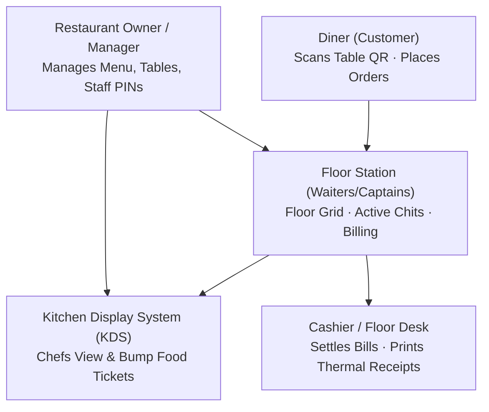

# Order Desk · Restaurant Operations & Staff Manual

> **A Comprehensive Guide for Restaurant Owners, Floor Captains, Cashiers, Waiters, and Kitchen Chefs.**  
> Order Desk is an end-to-end restaurant operating system engineered for fast-paced dining floors, instant QR ordering, and zero-delay kitchen communication.

---

## 1. System Roles & Responsibilities



| Role | Primary Device | Primary Responsibilities |
|:---|:---|:---|
| **Owner / Admin** | Laptop / Tablet | Full catalog pricing, staff PIN management, table QR generation, revenue tracking |
| **Floor Captain / Waiter** | Shared Tablet / Mobile | Table seating, quick item punching, chit inspection, bill settlement |
| **Kitchen Chef** | Wall-mounted KDS Screen | Cooking incoming tickets, bumping dishes to `served`, instant 86 out-of-stock items |
| **Diner (Customer)** | Personal Mobile Phone | Scanning table QR code, self-service ordering, tracking order status |

---

## 2. Daily Shift Login (Fast PIN Terminal)

Shared restaurant tablets use a **tactile 4-digit PIN** for instant switching between team members without typing long passwords.

### Step 1: Open Terminal
Go to:
```text
http://localhost:3000/login
```

### Step 2: Select Server Avatar
- On the warm-paper ticket, click your name avatar under **"Select Server"** (e.g. `Anand Kumar`, `Tarique`, etc.).

### Step 3: Tap Your 4-Digit PIN
- Use the on-screen numeric touch keypad (or physical keyboard / numpad).
- As soon as the 4th digit is entered, the system verifies your encrypted hash and automatically logs you in.
- The station displays: **`Welcome, [Your Name]!`** and navigates to the Floor Overview.

> [!TIP]
> **Owner Fallback Login**: If you need to log in with an email and password (or to recover an account), click **`Admin / Password login`** at the bottom of the screen.

---

## 3. Floor Overview & Live Table Management (`/`)

The main dashboard is the heartbeat of your dining floor.

### Table Status Color Codes

| Tone | Status | Meaning | Action Required |
|:---:|:---:|:---|:---|
| **Dashed Gray** | `FREE` | Table is empty and clean | Ready to seat walk-in guests |
| **Amber** | `ORDERED` | Order placed, waiting for kitchen | Kitchen chef needs to start preparation |
| **Amber** | `COOKING` | Food is actively being prepared | Standing by for pickup |
| **Blue** | `DINING` | All food served to diners | Diners currently enjoying their meal |
| **Pulsing Red** | `BILL REQ` | Diners requested bill or attention | Cashier must print receipt and collect payment |

---

### Station Active Chit Drawer (Click Any Table)

Clicking on any table tile opens the **Station Active Chit Drawer**:

1. **Active Session Timer**: Live elapsed minutes since the table sat down.
2. **Server Assigned**: Name of the staff member responsible for the table.
3. **Itemized Dishes**: Live list of ordered dishes with quantities, rates, and customer special notes (*"Note: Medium spicy, extra butter on naan"*).
4. **Subtotal, GST & Total**: Live calculated subtotal with 5% GST breakdown.
5. **Print Thermal Receipt**: Sends the bill directly to your counter's 80mm or 58mm thermal receipt printer.
6. **Mark Paid & Free Table**: 
   - Settles the bill in PostgreSQL (`payment_status: 'paid'`).
   - Closes the active table order.
   - Instantly marks the table `empty` on the floor layout.

---

### 1-Tap Quick Punch (Bestsellers Bar)

Located directly below the floor grid:
- To add a quick item (e.g., extra *Garlic Naan* or *Masala Chai*) to an active table:
  1. Click on the table in the grid.
  2. Tap any dish in the **Popular Fast Items** bar.
  3. The item is instantly added to the active table session and dispatched to the kitchen.

---

### Quick Order Modal (`+ New Order`)

To create an order on behalf of walk-in guests:
1. Click **`+ New Order`** in the top right.
2. Select an available table from the dropdown.
3. Choose guest count.
4. Check the dishes from the live catalog list.
5. Click **`Dispatch to Kitchen`**. The table turns Amber immediately and a ticket generates in the kitchen.

---

## 4. Kitchen Display System — KDS (`/kitchen`)

The Kitchen Display System replaces lost paper kitchen order tickets (KOTs) with a real-time order rail.

- **Audio Service Bell**: Whenever a new customer order arrives, an acoustic notification chime rings.
- **Timer Alert Thresholds**:
  - **0 - 7 minutes**: Normal ticket (White/Cream header).
  - **8 - 11 minutes**: Priority cooking (Light Amber header).
  - **12+ minutes**: Running Late warning (Pulsing Red header with warning icon).
- **1-Tap Dish Bumping**:
  - Chefs tap **`Mark Cooking`** when starting preparation.
  - Chefs tap **`Mark Served`** when food is plated and ready for the waiter to dispatch.
  - When all dishes on a ticket are served, the table turns Blue (`DINING`) on the front desk.

---

## 5. Table & QR Management (`/tables`)

Order Desk provides contactless QR dining for every station.

### Viewing & Printing Table QRs:
1. Navigate to **`Tables`** in the sidebar.
2. Tap any table tile (e.g., `T01`, `T02`).
3. The system renders the crisp QR code chit on screen.
4. Click **`Print Table Chit`** to print the standee on your counter printer.
5. Place the printed QR standee on the dining table.

### Adding New Tables:
1. Click **`+ Add Table`**.
2. Enter the identifier (e.g., `T09`, `Patio-1`, `Terrace-3`).
3. Click **`Add Table`**. A secure cryptographic QR token is instantly created.

### Regenerating QR Codes (Security):
If a guest takes a photo of a table QR and attempts to place fake orders from outside your restaurant after leaving:
- Tap the table in `/tables` -> Click **`Regenerate Token`**.
- The old QR code is immediately invalidated; print the new chit for the table.

---

## 6. Menu Catalog & Instant "86" Stock Toggle (`/menu`)

### Adding Dishes:
1. Go to **`Menu`** in the sidebar.
2. Click **`+ Add Menu Item`**.
3. Fill in:
   - Dish Name (*"Paneer Butter Masala"*).
   - Category (*"Main Course"*).
   - Selling Price (₹) and Cost Price (Optional).
   - Veg / Non-Veg Indicator.
   - Bestseller Tag (Puts dish on 1-tap quick bar).

### Instant 86 (Out-of-Stock Toggle):
When ingredients run out during a busy dinner shift:
- Locate the dish in `/menu`.
- Tap the **`Available / In Stock`** toggle once.
- The dish turns gray and is marked **`86'd / Sold Out`**.
- **Result**: Diners scanning table QRs will immediately see the dish grayed out and cannot add it to their cart. Tap again when fresh stock arrives to restore it.

---

## 7. Staff Team & PIN Allocation (`/staff`)

Owners can manage floor staff and assign terminal PINs:

1. Navigate to **`Staff`** in the sidebar.
2. Click **`+ Add Staff`**.
3. Enter:
   - Full Name (e.g., *"Rahul Sharma"*).
   - Role:
     - `Waiter / Staff`: Floor order taking and table management.
     - `Kitchen`: Kitchen KDS display access.
     - `Admin`: Full access to menu pricing, staff PINs, and reports.
   - **4-Digit PIN**: Set a unique 4-digit code (e.g., `2468`).
4. Click **`Add Staff Member`**. The staff member can now log in immediately on the terminal.

---

## 8. Customer QR Ordering Experience (`/table/[token]`)

When diners sit down at your table:
1. **Scan**: Diner scans the table QR using their smartphone camera (no mobile app download required).
2. **Browse**: Diner views your digital menu with live photos, descriptions, veg/non-veg filter, and category pills.
3. **Customize**: Diner adds items to cart and can type special notes for the chef (*"No onion, please"*).
4. **Order**: Diner clicks **`⚡ Send Order to Kitchen`**.
5. **Real-Time Tracker**: Diner's phone shows a live status stepper:
   - `Order Placed` -> `Cooking in Kitchen` -> `Served at Table`.

---

## 9. Thermal Receipt Printing Specifications

Order Desk supports silent thermal printing on standard POS printers:
- **Paper Roll Width**: 80mm (standard desktop thermal printer) or 58mm (handheld Bluetooth printer).
- **Print Trigger**: Clicking **`Print Thermal Receipt`** triggers native thermal rendering without browser headers/footers.
- **Ticket Contents**:
  - Restaurant Name & Table Identifier.
  - Date, Time & Station Captain.
  - Itemized List with Quantities, Rates, and Subtotals.
  - GST / Tax Breakdown (5%).
  - Grand Total in Indian Rupees (`₹`).

---

*Order Desk · Built for Fast Restaurant Execution*
