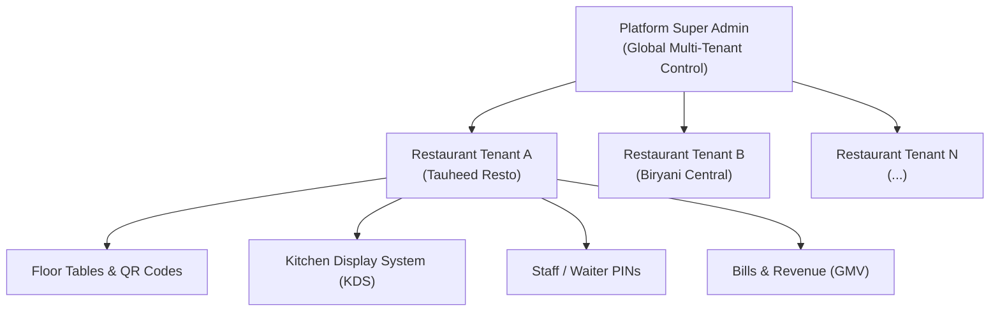

# Order Desk · Super Admin Platform & Operations Guide

> **Confidential · For Platform Administrators Only**  
> This document details the authentication workflow, tenant management, subscription lifecycle, and operational capabilities of the **Order Desk Super Admin Command Deck**.

---

## 1. Architecture Overview & Role Hierarchy

Order Desk is built as a high-performance, multi-tenant restaurant operations engine.



### Security Boundary:
- **Staff / Waiters**: Authenticate via 4-digit PIN scoped strictly to their individual restaurant station terminal.
- **Restaurant Owners**: Authenticate via Owner PIN or Email/Password for store management (`/tables`, `/menu`, `/staff`).
- **Super Admin**: Authenticates via platform email with global bypass rights to view and manage all restaurant tenants across the SaaS platform (`/super-admin`).

---

## 2. Super Admin Login Procedure (Step-by-Step)

Super Admin access is guarded by cryptographic session checks in `src/lib/auth/super-admin.ts` and server middleware.

### Step 1: Open Terminal Login
Navigate to the central login station:
```text
http://localhost:3000/login
```

### Step 2: Switch to Administrative Mode
By default, the terminal presents a 4-digit floor PIN keypad for speed on shared kitchen/floor tablets.
1. Scroll to the bottom of the warm-paper ticket.
2. Click the toggle link: **`Admin / Password login`** (or *Owner Administrative Login*).
3. The keypad smoothly toggles into the **Email & Password** authentication form.

### Step 3: Enter Super Admin Credentials
- **Email**: `tariqfsd9@gmail.com` *(or any email defined in `.env.local` `SUPER_ADMIN_EMAILS` or the `super_admins` database table)*.
- **Password**: Your registered Supabase platform password.
- Click **"Sign In with Password"**.

### Step 4: Access Super Admin Command Deck
Upon successful authentication:
- You will be redirected to the main terminal dashboard (`/`).
- Because your account has Super Admin privileges, a prominent badge will appear in the sidebar:
  **`⚡ Super Admin Desk → /super-admin`**
- Click this link or navigate directly to:
  ```text
  http://localhost:3000/super-admin
  ```
> [!NOTE]
> Non-super admin accounts attempting to access `/super-admin` or `/api/super-admin/*` will receive an immediate `403 Forbidden` response.

---

## 3. Super Admin Capabilities & Controls

The Super Admin command deck (`/super-admin`) provides real-time control across 5 core operational areas:

---

### A. Global Platform Analytics (Live Macro Dashboard)

| Metric | Description | Data Source |
|:---|:---|:---|
| **Platform Total GMV** | Cumulative gross merchandise value processed across all restaurants on the platform | Live database aggregate (`bills` where `payment_status = 'paid'`) |
| **Today's Platform Revenue** | Platform-wide bill collections since midnight today | Live database aggregate (`bills` paid today) |
| **Restaurant Fleet Count** | Total registered restaurant tenants onboarded | `restaurants` table count |
| **Active vs. Expired** | Breakdown of healthy paying restaurants vs. frozen accounts | `subscription_status` filter |
| **Plan Distribution** | Live counts of restaurants on `Trial`, `Basic` (₹999/mo), and `Pro` (₹2,499/mo) | Aggregated by `subscription_plan` |
| **Global Order Volume** | Total lifetime tickets and today's open/closed order volume | `orders` table aggregate |

---

### B. 1-Click Restaurant Onboarding (`+ Onboard Restaurant`)

When signing a new restaurant client, you do not need to interact with the database manually.

Click the **`+ Onboard Restaurant`** button to open the onboarding modal:

1. **Restaurant Name**: e.g., *"The Royal Biryani"*.
2. **Owner Name & Email**: Primary administrative contact.
3. **Contact Phone & GSTIN**: Optional billing and tax compliance fields.
4. **Starter Table Count**: e.g., 6, 12, or 20 tables. The system automatically creates `T01`, `T02`, ..., each equipped with its own unique cryptographic QR token.
5. **Initial Owner PIN**: 4-digit master PIN for floor terminal switching (defaults to `1234`).
6. **Subscription Plan**: Select initial tier (`Trial`, `Basic`, `Pro`).
7. **Seed Sample Menu (Toggle)**: Automatically populates the restaurant with popular Indian dishes (Paneer Butter Masala, Garlic Naan, Chicken Biryani, Masala Chai) so the client can immediately test ordering.

---

### C. Subscription & Account Freeze Controls

Super Admins have instantaneous control over tenant account access:

- **1-Click Freeze / Reactivate**: Toggle a restaurant's status between **`Active`** and **`Expired`** / **`Cancelled`**. Frozen restaurants cannot dispatch orders or operate floor tables until payment is resolved.
- **Plan Upgrade / Downgrade**: Upgrade clients from `Trial` to `Basic` or `Pro` upon subscription receipt.
- **Compliance & Metadata**: Edit phone numbers, legal trade names, and GSTIN numbers directly.

---

### D. Emergency Owner Credential Reset

If a restaurant owner forgets their PIN or gets locked out of their floor terminal:

1. Locate the restaurant in the fleet directory.
2. Click **`Reset Access`** on the restaurant card.
3. In the modal, you can:
   - **Set New 4-Digit PIN**: Instantly re-hashes and updates the owner's PIN via bcrypt.
   - **Set New Password**: Overrides the Supabase authentication password.
   - **Send Recovery Email**: Triggers an automated magic link / password reset email to the owner.

---

### E. Fleet Directory & Live Tenant Inspection

- **Real-Time Instant Search**: Filter by Restaurant Name, Owner Email, GSTIN, or UUID.
- **Status Filters**: Filter view by plan (`Trial`, `Basic`, `Pro`) or status (`Active`, `Expired`).
- **Live Per-Tenant Inspection**: Each restaurant card displays:
  - Total tables configured vs. currently occupied tables.
  - Total revenue (GMV) generated by this specific restaurant.
  - Active staff count registered under this restaurant tenant.

---

## 4. API Endpoints Reference

All Super Admin endpoints are secured by `requireSuperAdmin()` in `src/lib/auth/super-admin.ts`.

| Method | Endpoint | Description |
|:---|:---|:---|
| `GET` | `/api/super-admin/stats` | Fetches platform-wide metrics (GMV, orders, restaurant counts) |
| `GET` | `/api/super-admin/restaurants` | Retrieves full restaurant fleet with search and filter parameters |
| `POST` | `/api/super-admin/restaurants` | Onboards a new restaurant tenant with auth, tables, and starter menu |
| `PATCH` | `/api/super-admin/restaurants` | Updates tenant subscription plan, status, or GSTIN |
| `POST` | `/api/super-admin/restaurants/[id]/reset-owner` | Resets owner PIN and password credentials |

---

*Order Desk Platform Engineering · 2026*
